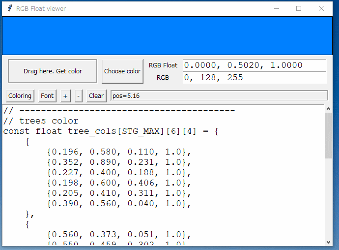
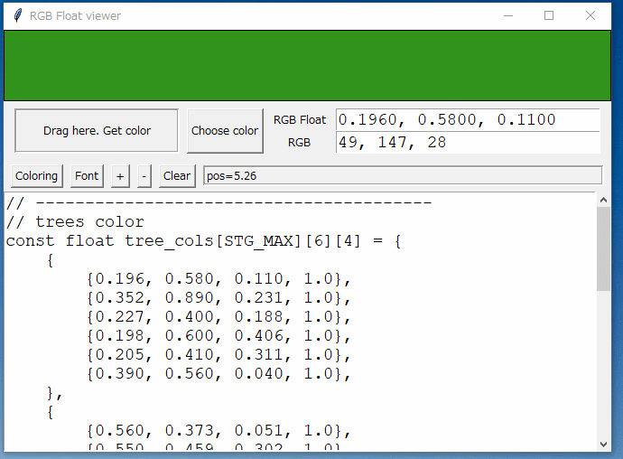
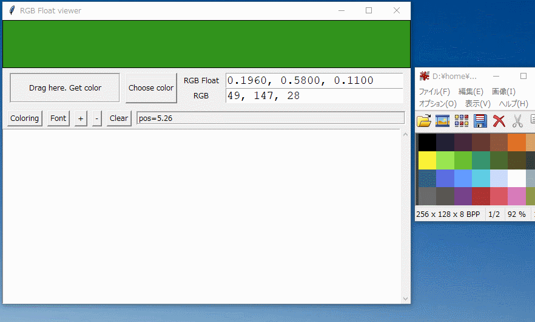

<!-- -*- encoding: utf-8 -*- -->

pyrgbfloatviewer
================

Color viewer. Color picker. View and check RGB Float by color.

RGB Float値を色表示して確認できるツール。

Description
-----------

一般的な色管理ツールはRGBを 0 - 255 の値で管理するが、
OpenGL はRGB値を 0.0 - 1.0 の値(RGB Float, RGB Unit, RGB \[0 - 1\]と呼ばれる) で指定する。


RGB Float で記述されていると一体どんな色なのか分かりづらいので、確認できるツールを作ってみた。

Screenshots
-----------

* マウスクリックで色を確認。



* 編集ウインドウ内で色付け。



* マウスドラッグでデスクトップ上の色を取得。



[Screenshot (movie)](./screenshots/pyrgbfloatviewer_ss.mp4)

Environment
-----------

* Windows10 x64 22H2
* Python 3.10.10 64bit
* tkinter
* PyAutoGUI 0.9.54
* pynput 1.6.8

Usage
-----

動作に必要なPythonモジュールをインストール。

```
python -m pip install pyautogui pynput
```

以下で実行。

```
python pyrgbfloatviewer.pyw
or
pythonw pyrgbfloatviewer.pyw
```

* 編集ウインドウ内に、「0.100, 0.200, 0.300」といったフォーマットで値を書けば、ウインドウ最上部に色が表示される。
* RGB Float値が書いてある場所をマウスクリック、もしくは、カーソルキーでカーソル位置を変更すると、その行に書かれた RGB Float値で色を表示する。
* 「Coloring」ボタンで、RGB Float値が記述された行の背景色を変更。
* 「Drag here」と書かれた部分をマウス左ボタンを押したままドラッグして、デスクトップ上のどこかでボタンを離せば、その場所の色を取得できる。
* 「Choose color」ボタンで色選択ダイアログを表示。OKを押すと編集ウインドウの最後にRGB Float値を追加。

### exeファイルへの変換について

試しにexeファイル化もしてみた。

1. pyrgbfloatviewer.dist/ フォルダ一式を別環境にコピー。
2. 中に入っている pyrgbfloatviewer.exe を実行すれば動く。

[exeファイルへの変換について](./convert_to_exe.md)

License
-------

pyrgbfloatviewer.pyw については、CC0 / Public Domain 扱いにします。

exeファイル版(pyrgbfloatviewer.dist/ 以下)は、各ライブラリのライセンスに従います。

Author
------

[mieki256](https://github.com/mieki256)

